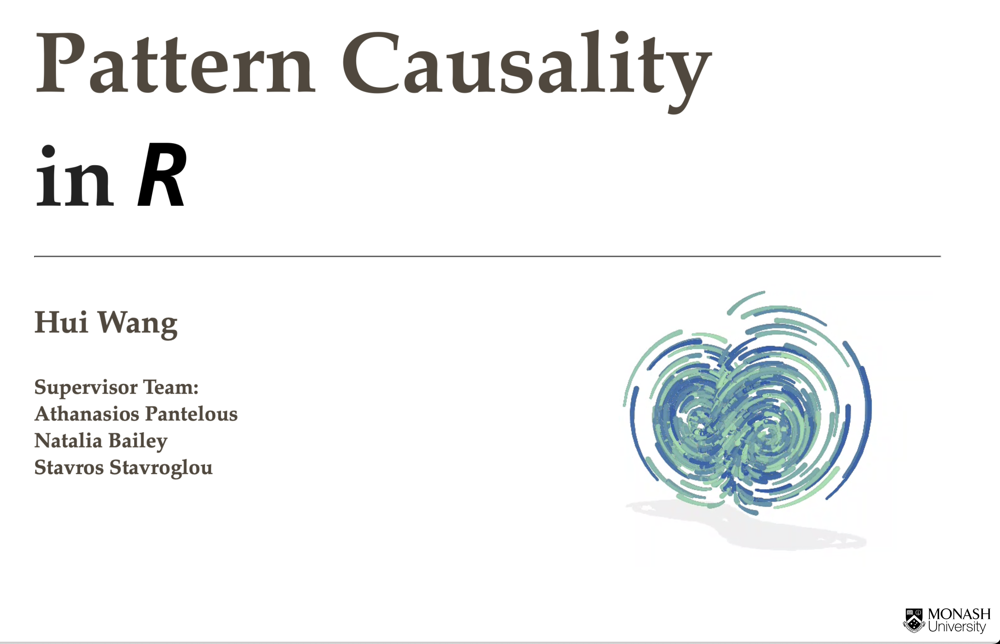

# Presentation for pattern causality



The related work as below.

>   `patterncausality` package in [CRAN](https://CRAN.R-project.org/package=patterncausality).  
`patterncausality` official [Github](https://github.com/skstavroglou/pattern_causality) page.  
`patterncausality` package [user guide](https://www.stavroglou.com/pattern_causality/articles/patterncausality.html).  
`patterncausality` paper in [SSRN](https://papers.ssrn.com/sol3/papers.cfm?abstract_id=4966221)

This presentation is based on `Observable.js`, `Echarts.js`, `D3.js`, `Mermaid`, `tikz`, `pseudocode` and `shiny`, before starting to run it, we need to make some preparations.

- Download the [Quarto](https://quarto.org/).
- Download the [R](https://www.r-project.org/)
- Install the required R packages, including `shiny`, `deSolve`, `tidyr`, `dplyr`, `patterncausality`

```R
install.packages(c("shiny", "deSolve", "tidyr", "dplyr", "patterncausality"))
```

The possible dependencies are

```shell
# On debian system
sudo apt install -y g++ gcc gfortran libreadline-dev libx11-dev libxt-dev \
            libpng-dev libjpeg-dev libcairo2-dev xvfb \
            libbz2-dev libzstd-dev liblzma-dev libtiff5 \
            libssh-dev libgit2-dev libcurl4-openssl-dev \
            libblas-dev liblapack-dev libopenblas-base \
            zlib1g-dev openjdk-11-jdk \
            texinfo texlive texlive-fonts-extra \
            screen wget libpcre2-dev make cmake \
            libssl-dev libxml2-dev libfontconfig1-dev libcurl4-openssl-dev \
            libharfbuzz-dev libfribidi-dev libfreetype6-dev libpng-dev libtiff-dev
```

If there is anything wrong, you can check the dependencies here, mostly it could be fixed.

## Start the presentation on Linux server

On Linux, we usually use the `systemctl` daemon to manage the Quarto service.

We need to download the files at first.

```shell
git clone https://github.com/wanghui5801/pattern_causality_presentation.git
```

Then add the configuration file

```shell
sudo nano /etc/systemd/system/quarto_presentation.service
```

The content is as follows:

```shell
[Unit]
Description=Quarto_Server
After=network.target

[Service]
# Your user name, usually could be got by $USER
User=
# The path of pattern_causality_presentation folder
WorkingDirectory=
# The path of quarto + "quarto serve presentation.qmd --host 0.0.0.0 --port xxx" you can define the port here
ExecStart=
Restart=always
RestartSec=10
Environment="PATH=/usr/local/sbin:/usr/local/bin:/usr/sbin:/usr/bin:/sbin:/bin"

[Install]
WantedBy=multi-user.target
```

Then update and start the `systemctl` sevice.

```shell
sudo systemctl daemon-reload
sudo systemctl start quarto_presentation.service
sudo systemctl enable quarto_presentation.service # Start automatically at boot
sudo systemctl status quarto_presentation.service # Check the status of service
```

Now the quarto server is running on `http://ip:port`

## Start the server on Windows or Mac

It would be easy to run after installing the necessary dependencies by the following code.

```shell
git clone https://github.com/wanghui5801/pattern_causality_presentation.git
cd pattern_causality_presentation
quarto serve presentation.qmd
```

Relevant information will be presented below.

## References

- Stavroglou, S. K., Pantelous, A. A., Stanley, H. E., & Zuev, K. M.
  (2019). Hidden interactions in financial markets. *Proceedings of the
  National Academy of Sciences, 116(22)*, 10646-10651.

- Stavroglou, S. K., Pantelous, A. A., Stanley, H. E., & Zuev, K. M.
  (2020). Unveiling causal interactions in complex systems. *Proceedings
  of the National Academy of Sciences, 117(14)*, 7599-7605.

- Stavroglou, S. K., Ayyub, B. M., Kallinterakis, V., Pantelous, A. A.,
  & Stanley, H. E. (2021). A novel causal risk‐based decision‐making
  methodology: The case of coronavirus. *Risk Analysis, 41(5)*, 814-830.
